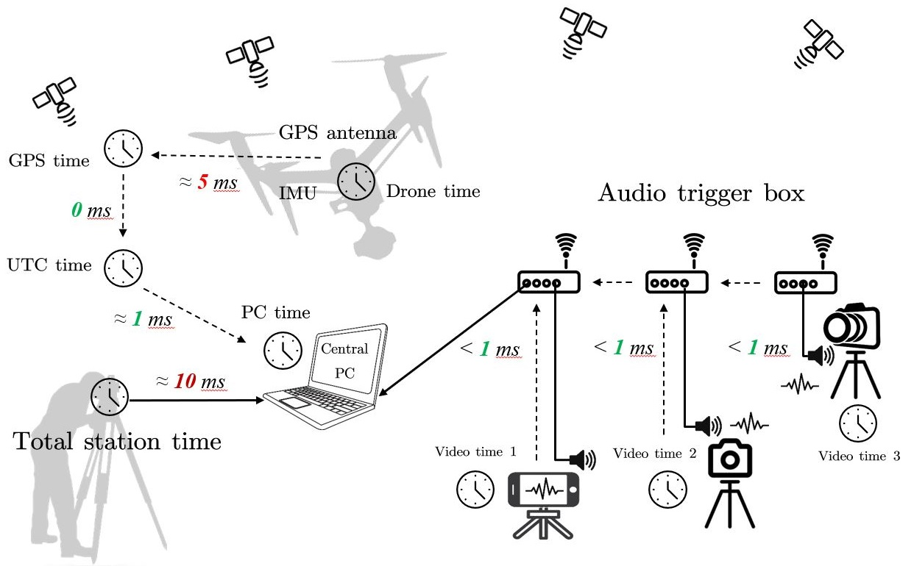

# IPA-GTDroneTraj
This repository is for the IPA project [Measuring Drone Trajectory using Total Stations with Visual Tracking](https://sirop.org/app/f76aed5f-95af-43db-a302-47ae994b03be) at ETH IGP.

### [Presentation slide](https://github.com/YuePanEdward/IPA-GTDroneTraj/blob/main/doc/ipa-presentation-1217.pdf)

### Frames overview
 

### Synchronization overview
 
  
## Dataset and evaluation tookkits coming soon

#### Acknowledgement:
[The previous dataset](https://github.com/CenekAlbl/drone-tracking-datasets)

[The visual trajectory drone reconstruction framework](https://github.com/CenekAlbl/mvus)
